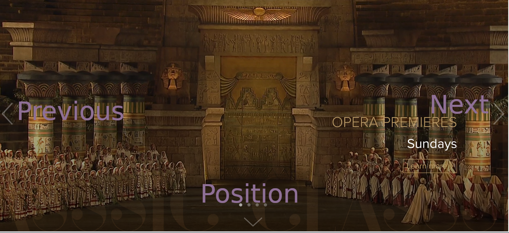

Carousel test for Stingray's HTML team
----------------------------------------

* Next: go to the next video
* Previous: go to the previous video
* Position: show where you are

The videos urls to be displayed in the carousel:
* https://brava.stingray.com/sites/brava/files/2018-09/Webclip-Verbier.mp4
* https://brava.stingray.com/sites/brava/files/2018-09/Webclip-Documentaries.mp4
* https://brava.stingray.com/sites/brava/files/2018-09/Webclip-Baroktober.mp4
* https://brava.stingray.com/sites/brava/files/2018-08/OperaPremiere-Webclip.mp4

Your carousel application will run in a 2 docker images that will use the docker-compose.yml file that is provided here.

To start the application type `docker-compose up`

and point your browser to `http://localhost:3000`

The server
----------
You need to build a rest service that will manage a carousel object that has a list of videos. You can use the server side language of your choice.

The carousel must contain minimally the following information :

*  The name of the carousel
*  A short description of the carousel
*  A list of videos

The videos must minimally contain

* The URL pointing to a usable image
* The title of the image
* A short description of the image

The client
----------

The client is a react application that will have at least a carousel component and an image component. It shall display the carousel information and the videos should change automatically every 10 seconds. The user also should also be able to manually go forward and back.

You will be judged
------------------
 * On the functionality of the application
 * On the elegance of your code
 * On the the unit tests that you will provide for the application

Bonus points
------------
You will get more points for more features but keep in mind that we mostly will judge you on the quality of the code submitted.

* Use [Redux](https://redux.js.org/). It is already in the `package.json`.
* Add the possibility to update the video information
* Put the information in a database in the backend
